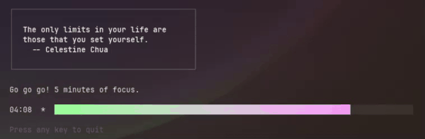

# Pomoloco :tomato:
A simple pomodoro CLI app written in Go.



## Roadmap
### mvp TODOs
- [x] pomo command: default 25-minute work session
- [x] loco command: default 5-minute break
- [x] exit command
- [x] help command
- [x] visual bar that shrinks with countdown

### level-up TODOs
- [x] bubbletea? lipgloss? yes
- [x] notification on end (sound?)
- [x] custom time for both pomo and loco sessions
- [x] press any key (other than space) to cancel session
- [x] fetch random motivational quote from zenquotes.io
- [x] skip to next session
- [x] loop pomo-loco sessions
- [ ] session title optional
- [ ] notes / reflections optional
- [ ] save sessions and notes in database
- [ ] refactor as per DRY

## Contributing

### clone the repo

```bash
git clone https://github.com/lulock/pomoloco
cd pomoloco
```

### build 

```bash
go build
```

### run executable

```bash
./pomoloco
```
### run tests 
no tests yet... 

### submit a pull request
To contribute, fork the repository and open a pull request to 'main'.

